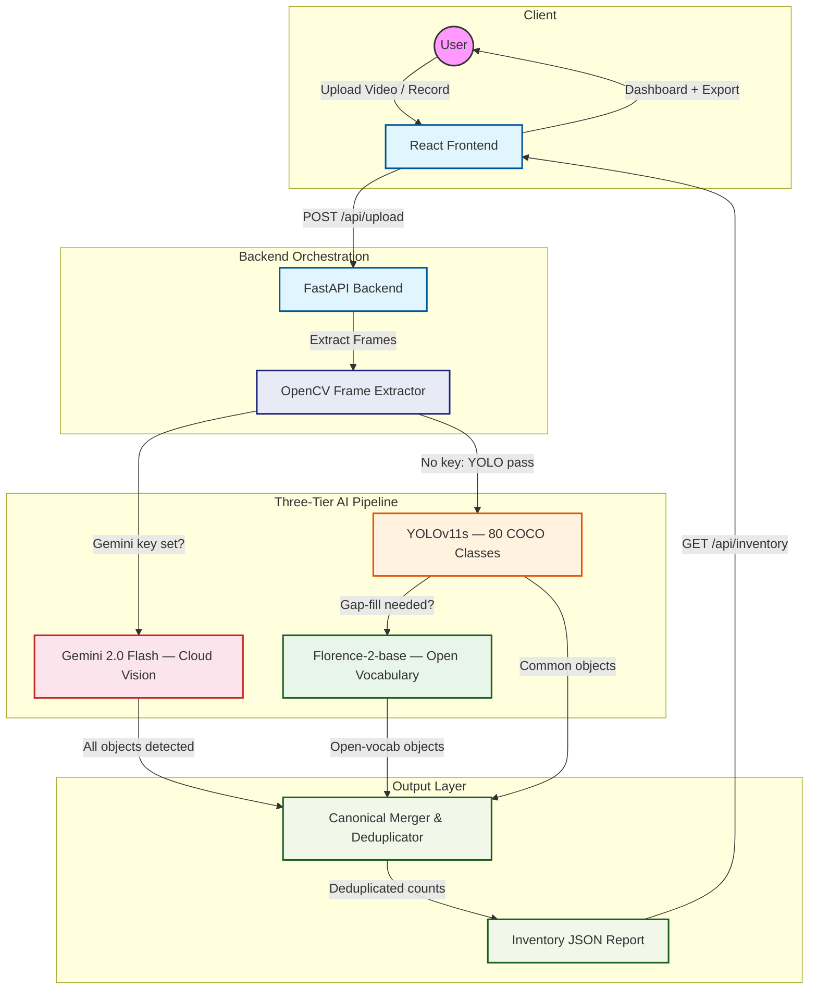

# VisionVault

     

**VisionVault** is a free, open-source platform for property managers, inspectors, and homeowners. Upload or record a video walkthrough and the system automatically extracts a structured, deduplicated inventory of furniture, appliances, and fixtures — powered by a smart three-tier AI pipeline that works with or without an API key.

---

## ⚡ Quick Access (Running Locally)

- **User Interface:** [http://localhost:3000](http://localhost:3000)
- **API Documentation:** [http://localhost:8000/docs](http://localhost:8000/docs)
- **Pipeline Health:** [http://localhost:8000/api/health](http://localhost:8000/api/health)

---

## 🚀 Key Features

- **Three-Tier AI Pipeline:** Gemini Vision (cloud) → YOLO + Florence-2 (local) → YOLO-only. Automatically uses the best available option.
- **Smart Frame Extraction:** OpenCV extracts 1 frame every 3 seconds (max 10 frames), auto-resized to 640px for fast inference.
- **Canonical Deduplication:** Objects seen across multiple frames are merged and canonicalized (couch→sofa, fridge→refrigerator) into a clean count.
- **Interactive Dashboard:** Search, filter by category, adjust quantities, add missing items, export as JSON or CSV.
- **Live Camera Recording:** Record a walkthrough directly from your browser via the HTML5 `MediaRecorder` API.
- **Zero Lock-in:** Works fully offline with local models. Add a Gemini key for cloud-quality results.

---

## 🏗 System Architecture



---

## 🛠 Technology Stack

### Backend (`FastAPI` + `Ultralytics` + `Florence-2` + `Gemini`)

- **FastAPI:** Async API server with background thread video processing
- **Google Gemini 2.0 Flash:** Cloud vision — detects all objects in one API call. Free tier: 1500 req/day. Get key at https://aistudio.google.com/apikey
- **YOLOv11s:** Local bounding-box detection for 80 COCO classes. Auto-downloads ~22MB on first run.
- **Microsoft Florence-2-base:** Local open-vocabulary vision model. Detects wardrobes, curtains, rugs, mirrors, lamps, shelves, and 50+ items YOLO cannot. Auto-downloads ~900MB on first run.
- **OpenCV:** Frame extraction, auto-resize, JPEG quality tuning

### Frontend (`React` + `Vite` + `Tailwind CSS`)

- **React 18 + Vite:** Fast dev server with HMR and optimized production builds
- **Glassmorphic Dark UI:** Premium dark mode with Tailwind CSS and Lucide icons
- **Live Camera:** In-browser recording via `MediaRecorder` API
- **Export:** JSON, CSV, clipboard copy

---

## 🤖 Three-Tier AI Pipeline

The backend automatically selects the best available pipeline:

```
┌─────────────────────────────────────────────────────────┐
│  Tier 1 — Gemini Vision (RECOMMENDED)                   │
│  Requires: GEMINI_API_KEY in .env                       │
│  Speed: ~15-20s  |  Detects: Everything (100+ objects)  │
│  Free tier: 1500 requests/day                           │
└─────────────────────────────────────────────────────────┘
         ↓ fallback if no API key
┌─────────────────────────────────────────────────────────┐
│  Tier 2 — YOLO + Florence-2 (LOCAL)                     │
│  Requires: Nothing (auto-downloads models)              │
│  Speed: ~30-60s on CPU  |  Detects: ~70+ objects        │
│  YOLO: fast pass → Florence-2: gap-fill on weak frames  │
└─────────────────────────────────────────────────────────┘
         ↓ fallback if Florence-2 unavailable
┌─────────────────────────────────────────────────────────┐
│  Tier 3 — YOLO Only (FASTEST LOCAL)                     │
│  Requires: Nothing                                      │
│  Speed: ~5-10s  |  Detects: 80 COCO classes             │
└─────────────────────────────────────────────────────────┘
```

### Detection coverage by tier

| Object | Gemini | YOLO + Florence-2 | YOLO only |
|--------|--------|-------------------|-----------|
| Sofa, chair, table, bed | ✅ | ✅ | ✅ |
| TV, fridge, sink, toilet | ✅ | ✅ | ✅ |
| Wardrobe, curtain, rug | ✅ | ✅ Florence-2 | ❌ |
| Mirror, lamp, shelf | ✅ | ✅ Florence-2 | ❌ |
| Fireplace, AC, chandelier | ✅ | ✅ Florence-2 | ❌ |
| Condition assessment | ✅ | ❌ | ❌ |

---

## 🏃 Local Initialization

### 1. Environment Configuration

Copy `.env.example` to `.env` in the `backend` directory:

```bash
cp backend/.env.example backend/.env
```

Add your Gemini key for best results (optional but recommended):

```env
GEMINI_API_KEY=your_key_here   # https://aistudio.google.com/apikey
MODEL=gemini-2.0-flash

UPLOAD_DIR=./uploads
FRAMES_DIR=./frames

USE_HYBRID=true
USE_FLORENCE=true
FLORENCE_MODEL=microsoft/Florence-2-base

MAX_FRAMES=10
FRAME_INTERVAL_SEC=3.0
FRAME_QUALITY=80
MAX_FLORENCE_CALLS=4
YOLO_SKIP_FLORENCE_TOTAL=12
```

### 2. Backend Setup

```bash
cd backend
pip install -r requirements.txt
uvicorn main:app --reload --port 8000
```

> YOLOv11s (~22MB) and Florence-2 (~900MB) download automatically on first scan and are cached locally.

### 3. Frontend Setup

```bash
cd frontend
npm install
npm run dev
```

App available at `http://localhost:3000`

---

## 🧪 System Validation

- **Pipeline Auto-Selection:** Verified automatic tier selection — Gemini → YOLO+Florence-2 → YOLO-only — based on available keys and models at startup.
- **Gemini Parallel Processing:** All frames sent to Gemini concurrently (ThreadPoolExecutor, 5 workers) for maximum speed.
- **YOLO Accuracy:** Confidence threshold 0.20 catches partially visible and angled objects. Non-household classes (vehicles, food, people) filtered via canonical mapping.
- **Florence-2 Gap-Fill:** Runs on up to 4 weakest YOLO frames per video. Skipped entirely if YOLO already found 12+ unique items.
- **Deduplication:** Canonical mapping consolidates synonyms across all frames into clean inventory counts.

---

## 📦 Production Roadmap

1. **GPU Acceleration** — Florence-2 drops from 5-8s/frame to <1s/frame on NVIDIA GPU
2. **Background Queues** — Celery + Redis for concurrent video processing
3. **Cloud Deployment** — Render (backend) + Vercel (frontend) with Gemini key
4. **Cloud Storage** — AWS S3 for video and frame storage
5. **Database** — PostgreSQL for persistent reports and multi-property accounts
6. **Auth** — User accounts to separate inventories per property

---

## 📄 License

- [YOLOv11 (Ultralytics)](https://github.com/ultralytics/ultralytics) — AGPL-3.0
- [Florence-2 (Microsoft)](https://huggingface.co/microsoft/Florence-2-base) — MIT
- [FastAPI](https://fastapi.tiangolo.com) — MIT
- [React](https://react.dev) — MIT
- [Tailwind CSS](https://tailwindcss.com) — MIT

---

*© 2026 VisionVault AI. Built with ❤️ using open-source AI.*
