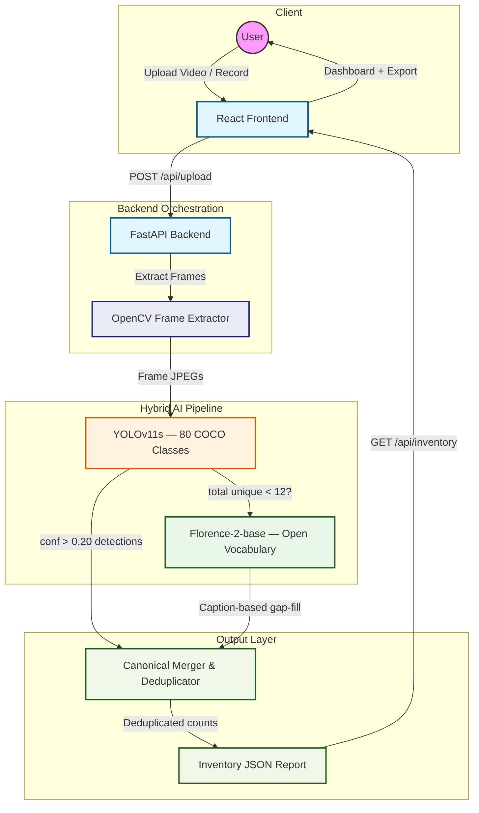

# VisionVault

    

**VisionVault** is a 100% free, open-source platform for property managers, inspectors, and homeowners. Upload or record a video walkthrough and the system automatically extracts a structured, deduplicated inventory of furniture, appliances, and fixtures — powered by a local **YOLO + Florence-2 hybrid AI pipeline** with no paid API key required.

---

## ⚡ Quick Access (Running Locally)

The application is currently active. Use the following links:

- **User Interface:** [http://localhost:3000](http://localhost:3000)
- **API Documentation:** [http://localhost:8000/docs](http://localhost:8000/docs)
- **Pipeline Health:** [http://localhost:8000/api/health](http://localhost:8000/api/health)

---

## 🚀 Enterprise-Grade Capabilities

- **Hybrid AI Detection:** YOLOv11s for fast bounding-box detection (80 COCO classes) combined with Microsoft Florence-2 for open-vocabulary scene captioning — catches everything YOLO misses like wardrobes, curtains, rugs, mirrors, and lamps.
- **Smart Frame Extraction:** OpenCV extracts 1 frame every 3 seconds (max 12 frames) with auto-resize to 640px for optimal inference speed.
- **Canonical Deduplication:** Objects detected across multiple frames are merged, canonicalized (couch→sofa, fridge→refrigerator), and counted into a clean inventory.
- **Interactive Dashboard:** Search, filter by category, adjust quantities, add missing items manually, export as JSON or CSV.
- **Live Camera Recording:** Native HTML5 `MediaRecorder` API — record a walkthrough directly from your browser, no external app needed.
- **Zero Cloud Dependency:** No OpenAI, no Gemini, no Pinecone. Everything runs on your machine. Optional Gemini key supported as a cloud override.

---

## 🏗 System Architecture



---

## 🛠 Technology Stack

### Backend Engine (`FastAPI` + `Ultralytics` + `Florence-2`)

- **FastAPI:** Async high-performance API server with background thread video processing
- **YOLOv11s:** Real-time bounding-box detection — auto-downloads on first run (~22MB)
- **Microsoft Florence-2-base:** Open-vocabulary vision-language model via HuggingFace Transformers — auto-downloads on first run (~900MB). Detects wardrobes, curtains, rugs, mirrors, lamps, shelves, and 50+ items YOLO cannot.
- **OpenCV:** Frame extraction, auto-resize to 640px, JPEG quality tuning
- **Pipeline Auto-Selection:** Backend detects available models at startup and selects the best pipeline automatically — no manual config needed

### Frontend Interface (`React` + `Vite` + `Tailwind CSS`)

- **React 18 + Vite:** Fast dev server with HMR and optimized production builds
- **Glassmorphic Dark UI:** Premium dark mode design with Tailwind CSS and Lucide icons
- **Live Camera:** In-browser video recording via `MediaRecorder` API — no plugins needed
- **Export Options:** Download inventory as JSON or CSV, or copy to clipboard

---

## 🤖 Hybrid AI Pipeline

The system uses a two-stage pipeline that maximises detection coverage while keeping inference fast:

```
Every video frame
      │
      ▼
 ┌───────────┐  conf > 0.20, parallel
 │ YOLOv11s  │ ──────────────► chair, sofa, tv, bed, sink, refrigerator...
 └───────────┘  (~2s/frame on CPU)
      │
      │  total unique items < 12?
      ▼
 ┌─────────────┐  up to 4 weak frames
 │ Florence-2  │ ──────────────► wardrobe, curtain, rug, mirror, lamp,
 └─────────────┘  (~5-8s/frame)   shelf, fireplace, painting, plant...
      │
      ▼
 Canonical Merge + Dedup → Inventory Report
```

### What each model detects

| Category | YOLO | Florence-2 |
|----------|------|------------|
| Sofa, chair, table, bed | ✅ | ✅ |
| TV, laptop, refrigerator, sink | ✅ | ✅ |
| Toilet, microwave, oven | ✅ | ✅ |
| Wardrobe, closet, dresser | ❌ | ✅ |
| Curtain, rug, blinds | ❌ | ✅ |
| Mirror, painting, picture frame | ❌ | ✅ |
| Lamp, chandelier, ceiling fan | ❌ | ✅ |
| Fireplace, radiator, staircase | ❌ | ✅ |
| Shelf, bookcase, rack | ❌ | ✅ |

### Pipeline auto-selection

| Condition | Pipeline used |
|-----------|--------------|
| YOLO + Florence-2 both available | `yolo + florence-2` ✅ |
| Only YOLO available | `yolo-only` |
| Only Florence-2 available | `florence-2 only` |
| Gemini API key set | `gemini` (cloud override) |
| Nothing available | `simulated` (UI testing) |

---

## 🏃 Local Initialization

### 1. Environment Configuration

Create a `.env` file in the `backend` directory:

```env
# Gemini disabled — using free local pipeline
GEMINI_API_KEY=
MODEL=gemini-2.0-flash

# Directories
UPLOAD_DIR=./uploads
FRAMES_DIR=./frames

# Pipeline
USE_HYBRID=true
USE_FLORENCE=true
FLORENCE_MODEL=microsoft/Florence-2-base

# Speed + accuracy tuning
MAX_FRAMES=12
FRAME_INTERVAL_SEC=3.0
FRAME_QUALITY=80
YOLO_GAP_THRESHOLD=4
MAX_FLORENCE_CALLS=4
YOLO_SKIP_FLORENCE_TOTAL=12
```

### 2. Backend Setup

```bash
cd backend
pip install -r requirements.txt
uvicorn main:app --reload --port 8000
```

> Florence-2 (~900MB) and YOLOv11s (~22MB) download automatically from HuggingFace and Ultralytics on the **first scan**. After that they are cached locally.

### 3. Frontend Setup

```bash
cd frontend
npm install
npm run dev
```

App available at `http://localhost:3000`

---

## 🧪 System Validation

- **Pipeline Auto-Detection:** Verified automatic fallback chain — `yolo + florence-2` → `yolo-only` → `florence-2 only` → `simulated` — based on available models at startup.
- **YOLO Accuracy:** Detects 80 standard COCO classes at confidence threshold 0.20, filtering non-household classes (vehicles, food, people) via canonical mapping.
- **Florence-2 Gap-Fill:** Successfully identifies wardrobes, curtains, rugs, mirrors, lamps, shelves, and 50+ open-vocabulary items that YOLO's fixed class list cannot detect. Runs on up to 4 weakest frames per video.
- **Deduplication:** Canonical name mapping consolidates synonyms (couch→sofa, fridge→refrigerator, lamp→light) across all frames into clean inventory counts.
- **Speed:** Typical 30-second property video completes in 15–30 seconds on CPU (YOLO-only fast path) or 30–60 seconds with Florence-2 gap-fill.

---

## 📦 Production Roadmap

1. **GPU Acceleration** — Run on NVIDIA GPU for Florence-2 inference in <1s/frame instead of 5-8s
2. **Background Queues** — Celery + Redis for concurrent video processing without blocking
3. **Cloud GPU** — Host backend on RunPod or AWS EC2 g4dn for faster inference
4. **Cloud Storage** — Replace local file saving with AWS S3
5. **Database** — PostgreSQL via Supabase for persistent reports and multi-property accounts
6. **Auth** — User accounts to separate inventories per property

---

## 📄 License

Built entirely on open-source libraries. Review individual licenses for commercial use:

- [YOLOv11 (Ultralytics)](https://github.com/ultralytics/ultralytics) — AGPL-3.0
- [Florence-2 (Microsoft)](https://huggingface.co/microsoft/Florence-2-base) — MIT
- [FastAPI](https://fastapi.tiangolo.com) — MIT
- [React](https://react.dev) — MIT
- [Tailwind CSS](https://tailwindcss.com) — MIT

---

*© 2026 VisionVault AI. Built with ❤️ using open-source AI.*
