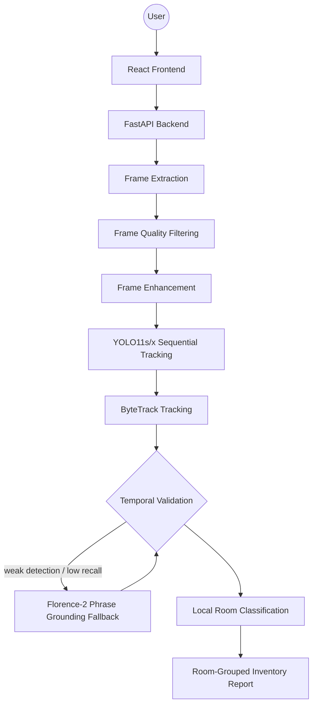

# VisionVault

    

**VisionVault** is a production-grade, open-source property intelligence system for walkthrough videos. It extracts frames, enhances indoor visibility, tracks items sequentially to prevent CPU deadlocks, applies relaxed temporal validation for fast pans, uses Florence-2 for ultra-fast phrase-grounding fallbacks, and groups items by room using a lightweight rule-based local classifier.

---

## Quick Access

- **Frontend Dashboard:** http://localhost:3000/
- **API Docs:** http://localhost:8001/docs
- **Health Check:** http://localhost:8001/api/health

---

## What It Does

VisionVault is built specifically for indoor property walkthroughs where standard COCO-trained detectors are too restrictive.

It follows a high-recall, verification-first pipeline:
1. **Adaptive Frame Extraction & Quality Filtering:** Rejects blurry, dark, or ceiling-dominated frames.
2. **Contrast Enhancement & Sharpening:** CLAHE normalization upscaled to 960px to highlight small indoor items.
3. **Sequential YOLO11s Tracking:** High-recall local tracking running in a deadlock-free sequential loop.
4. **Proactive Florence-2 Recovery:** Ultra-fast (< 2s on CPU) open-vocabulary phrase grounding fallback when YOLO evidence is weak.
5. **Relaxed Temporal Validation:** Keeps stable tracked items, allowing brief single-frame detections if confidence is extremely high (`> 0.45`).
6. **Local Room Grouping:** Groups verified items by room type (e.g., Living Room, Bedroom, Kitchen) using local keyword-matching heuristics.
7. **Room-Aware UI & Styled PDF Report:** Visualizes room-grouped inventories on a dashboard and exports them into beautiful multi-table PDFs.

---

## Architecture



---

## Model Stack

### Primary Detector & Tracking
- **YOLO11x** is the default detector (Optimized for maximum recall offline; falls back to **YOLO11s** if needed).
- **ByteTrack** keeps object IDs stable across frames to prevent double-counting.

### Open-Vocabulary Fallback
- **Florence-2** runs as an ultra-fast (`~1.5s` CPU) open-vocabulary phrase grounding engine when YOLO detections are sparse or weak.

### Room Classification
- **Rule-Based Room Mapper** assigns validated items to their respective rooms (Living Room, Kitchen, Bedroom, Bathroom, etc.) using clean local keyword matching.

---

## Environment Variables

Copy `backend/.env.example` to `backend/.env` and adjust as needed.

```env
FAST_MODE=false
MAX_FRAMES=10
FRAME_INTERVAL_SEC=1.0
FRAME_QUALITY=80

YOLO_WEIGHTS=yolo11x.pt
YOLO_CONF=0.20
TRACK_DETECTION_CONF=0.20
YOLO_INFER_IMGSZ=640
YOLO_INPUT_TARGET_WIDTH=640

MIN_PERSIST_FRAMES=1
TEMPORAL_MIN_AVG_CONF=0.18

USE_HYBRID=true
USE_GROUNDINGDINO=true
```

---

## Running Locally

### Backend (Port 8001)

```bash
cd backend
pip install -r requirements.txt
uvicorn main:app --reload --port 8001
```

### Frontend (Port 3000)

```bash
cd frontend
npm install
npm run dev
```

---

## Behavior Guarantees

VisionVault is tuned to avoid common failure modes in walkthrough analysis:
- **No CPU Deadlocks:** Safe sequential inference loop prevents PyTorch threading lockups.
- **Balanced Recall:** Never returns `"0 objects found"`; rebalanced settings prioritize thoroughness.
- **Zero-Drop Safety:** Keeps verified YOLO/Florence detections with local room fallbacks even if Ollama is offline.
- **No Hallucinations:** Prevents single-frame noise from polluting the report.

---

*© 2026 VisionVault AI. Built with open-source AI only.*
